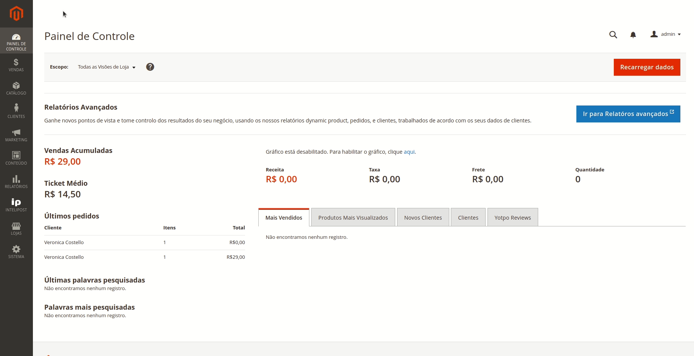
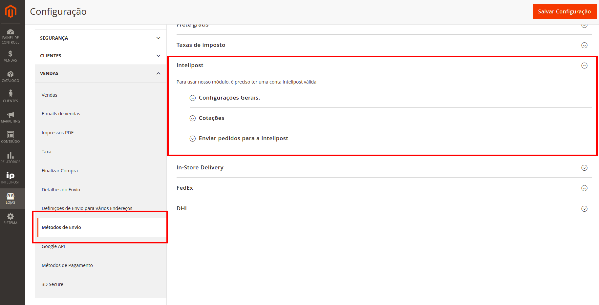
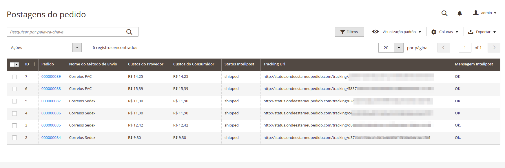
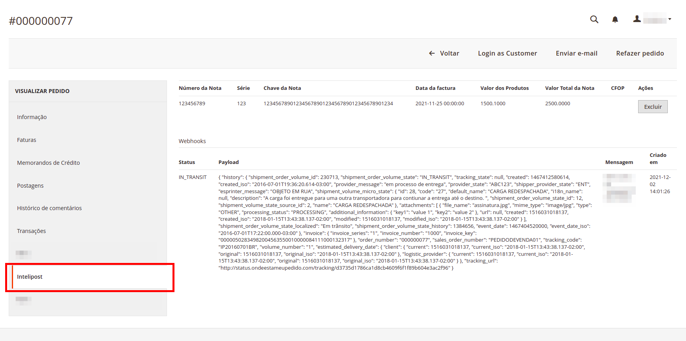
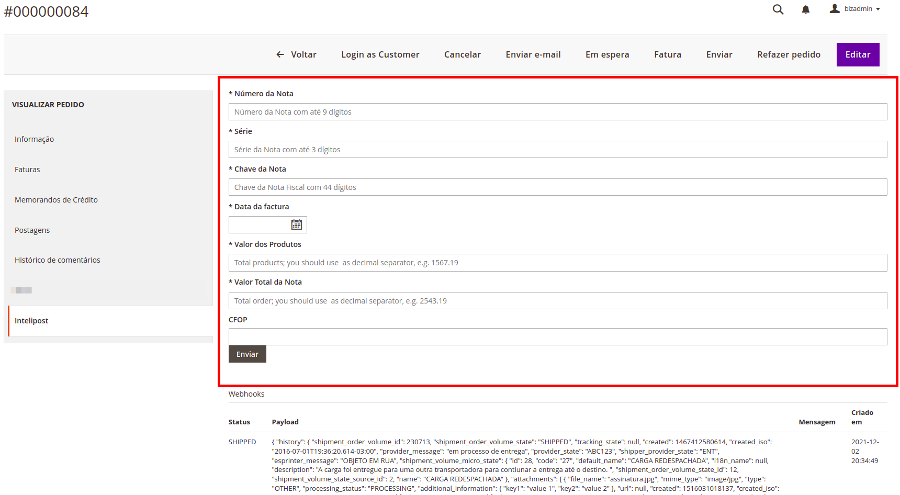
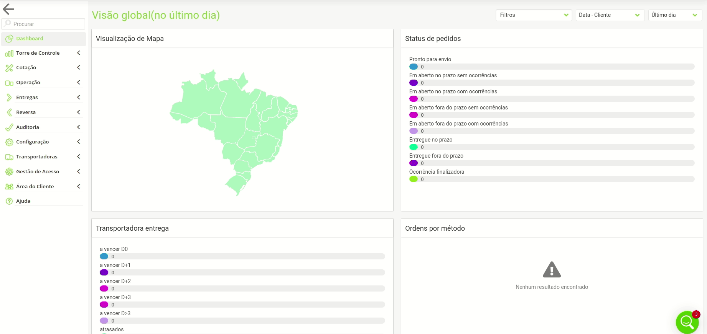

# Intelipost - Adobe Commerce


#Instalação
Para a utilização desses módulos, é recomendável remover os módulos antigos da cotação da Intelipost.
```
composer remove intelipost/magento2-push
composer remove intelipost/magento2-quote
composer remove intelipost/magento2-tracking
```

Após remover os módulos antigos, só instalar o módulo novo (em breve estará no packagist)
```
composer config repositories.intelipost-shipping git https://github.com/intelipost/Magento2.git
composer require intelipost/magento2:dev-master
php bin/magento setup:static-content:deploy pt_BR
php bin/magento setup:upgrade
php bin/magento setup:di:compile
```


**Instalação Manual**

Download o arquivo e coloque na pasta
```
app/code/Intelipost/Shipping
```

Depois rodar os comandos de instalação

```
php bin/magento setup:upgrade
php bin/magento setup:di:compile
php bin/magento setup:static-content:deploy pt_BR en_US
```

## Descrição
Módulo disponível em português e inglês, compatível com a versão 2.3+ do Adobe Commerce.  
O módulo utiliza a API da Intelipost para a cotação de frete e envio de pedidos para a Intelipost

## Menu


## Configurações

#### Cotação de Frete baseado nas regras cadastradas na Intelipost  

  

Nas configurações da loja, pode-se determinar como o módulo deve funcionar, dentre eles:
- Chaves de Configuração   
- Se irá usar Centro de Distribuição Cadastrado na Loja como Origem  
- Código enviar no sales_channel para identificação dentro da Intelipost  
- Campo de CPF no cadastro do cliente  
- Adicionar Cálculo de Frete na Página de Produto  
- Adicionar dias à cotação  
- Unidade de Medida utilizada  
- Quais atributos serão utilizados para dimensões  
- Enviar pedidos para a Intelipost  
- Habilitar webhook para recebimento de atualizações de status de pedidos  
- Alteração de status para as etapas do envio  

## Postagens do Pedido  

  

- Nesse link, é possível ver todas as postagens dos pedidos, com link para o pedido, e as URL dos pedidos
- Através dessa tela, é possível criar e enviar pedidos para Intelipost através do menu de Ações
- Dentro de cada pedido tem uma nova aba também para que você possa ver os status desses pedidos
-   

## Faturas

  

- Nesse link, é possível ver todas as faturas enviadas dos pedidos, que serão enviadas para a Intelipost
- As faturas podem ser enviadas via admin, na página do pedido, ou via API  
  
*Página de Pedido*  


*VIA API*
- "POST" - /V1/intelipost/invoices (Criar nova Invoice)
- "GET" - /V1/intelipost/invoices (Listar Invoices)


## Webhooks


- Nesse link, é possível ver todas as notificações via webhook recebidas
- Lembrando que é preciso cadastrar os webhooks dentro da Intelipost



#### A URL deve ser:  
_https://URL_LOJA/intelipost/webhook_  
*Autenticação Basic*  
Usuário da Autenticação será sua chave de API  
Senha de autenticação podera ser preenchida com 123, apenas para não ficar vazia.  
